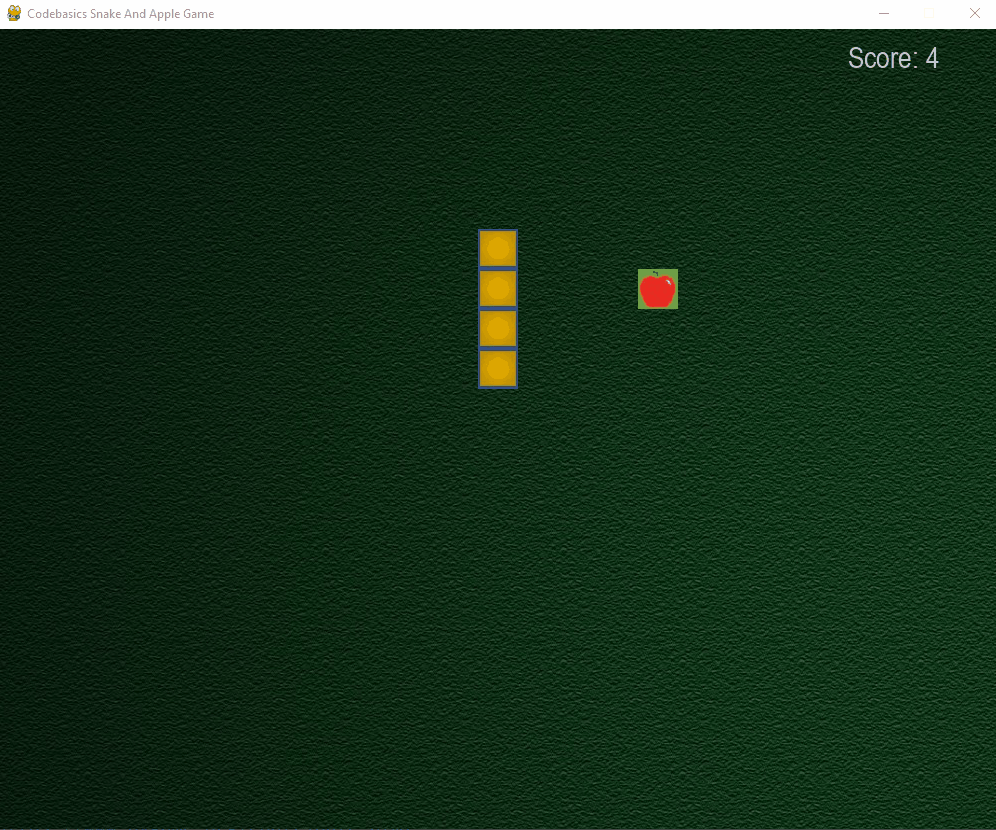

## Snake and Apple Game
Building snake and apple game in `pygame and python`

Snake and apple is a simple game where when snake eats an apple it gets longer and your score increases. If you snake hits any part of its body it will die.

**Final source code is in 8_final_code_background_music.py**

### Exercise

1. Add a logic to end the game if snake hits any of the wall boundaries of main screen. 
Here you need to check the position of your head and see if it goes beyond window boundaries (1000,800). 
If it does, game should end in same way as we end it when snake collides with itself.

2. Try increasing speed of snake to make game little more challenging.  Reduce the sleep time to may be 0.1 sec to achieve this.

[Solution](https://github.com/codebasics/python_projects/blob/main/1_snake_game/exercise_solution.py)

### Tool to convert python file to .exe

I used below tool to convert python file to .exe file

https://pypi.org/project/auto-py-to-exe/

